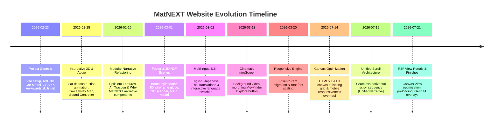

# MatNEXT Web Application: Comprehensive Evolution Report

> **Project:** MatNEXT App  
> **Repository Scope:** `jeshwanthshivasai/MatNEXT-App`  
> **Commit History Range:** Commit `f3c7408` (Feb 23, 2026) — Commit `f53fcc1` (Jul 21, 2026)  
> **Total Commits Analyzed:** 107 Commits  
> **Report Generated:** July 30, 2026  

---

## Executive Summary

The **MatNEXT** web application has undergone a transformation from an initial single-page React proof-of-concept into a world-class, multi-sensory, Awwwards-caliber B2B SaaS web experience. 

Over the course of 107 commits between February 2026 and July 2026, the application evolved through six major architectural and visual phases:
1. **Interactive 3D Foundations & Physics-based Deconstruction**
2. **Modular Section Refactoring & Narrative Extraction**
3. **Multilingual Internationalization (i18n) & Sound Engine Integration**
4. **Cinematic Viewfinder Explorer & Homing Camera Systems**
5. **High-Performance Canvas Rendering & Responsiveness Overhaul**
6. **Unified Horizontal Scroll Architecture & R3F View Systems**

---

## Key Analytics & Repository Summary

| Metric | Details |
| :--- | :--- |
| **Total Commits** | **107** |
| **Development Timeline** | Feb 23, 2026 – Jul 21, 2026 (~5 months) |
| **Core Frameworks** | React 18, Vite, TypeScript |
| **3D & Graphics Engine** | Three.js, React Three Fiber (R3F), `@react-three/drei`, Spline 3D |
| **Animation & Motion** | GSAP (GreenSock), ScrollTrigger, Lenis Smooth Scroll |
| **Audio Engine** | Custom Web Audio API Sound Controller |
| **Localization** | `i18next`, `react-i18next` (English `en`, Japanese `jp`, Thai `th`) |
| **Styling & Layout** | Tailwind CSS, Custom Canvas API, Fluid `rem` Scaling System |

---

## Architectural & Timeline Flow

---

## Chronological Phase Breakdown

### Phase 1: Project Genesis & 3D Interactive Foundations (Feb 23 – Feb 25, 2026)
*Commits `f3c7408` to `edda6f6` (Commits 1–37)*

- **Initial Setup:** Initialized the React + Vite + TypeScript application structure with Awwwards design guidelines and custom R3F/Tailwind setups ([App.tsx](file:///Users/jeshwanthshivasai/Github/MatNEXT-App/src/App.tsx)).
- **Deconstructible 3D Car Model:** Introduced the core hero centerpiece: an interactive 3D sedan model ([DeconstructibleCar.tsx](file:///Users/jeshwanthshivasai/Github/MatNEXT-App/src/components/common/DeconstructibleCar.tsx)) with custom exploding part logic, wireframe transparency, frustum culling overrides, and scroll-driven explosion animations.
- **Traceability Map & Hero Statistics:** Integrated [TraceabilityMap.tsx](file:///Users/jeshwanthshivasai/Github/MatNEXT-App/src/components/common/TraceabilityMap.tsx) and [HeroStats.tsx](file:///Users/jeshwanthshivasai/Github/MatNEXT-App/src/components/common/HeroStats.tsx) to map vehicle material components to supply chain sustainability metrics.
- **Smooth Scroll & Audio Controller:** Configured Lenis smooth scrolling for high-friction inertia scrolling and built a Web Audio API controller for contextual UI feedback.

---

### Phase 2: Modular Section Refactoring & Narrative Extraction (Feb 26 – Mar 1, 2026)
*Commits `f9c691f` to `25e916b` (Commits 38–61)*

- **Narrative Component Architecture:** Deconstructed a monolithic `App.tsx` layout into dedicated, highly isolated narrative modules:
  - [FeaturesNarrative.tsx](file:///Users/jeshwanthshivasai/Github/MatNEXT-App/src/components/common/FeaturesNarrative.tsx): Horizontal scroll feature cards with entrance animations.
  - [AINarrative.tsx](file:///Users/jeshwanthshivasai/Github/MatNEXT-App/src/components/common/AINarrative.tsx): 3D Document Scanner animation and sci-fi brain model.
  - [TractionNarrative.tsx](file:///Users/jeshwanthshivasai/Github/MatNEXT-App/src/components/common/TractionNarrative.tsx): Interactive 3D rotating wireframe globe replacing legacy 2D dot grids.
  - [WhyMatNextNarrative.tsx](file:///Users/jeshwanthshivasai/Github/MatNEXT-App/src/components/common/WhyMatNextNarrative.tsx): Stakeholder-centric platform value propositions.
  - [FooterNarrative.tsx](file:///Users/jeshwanthshivasai/Github/MatNEXT-App/src/components/common/FooterNarrative.tsx): Bento-style contact grid with dynamic navigation bar auto-hiding.
- **Asset & Performance Cleanup:** Removed legacy sedan assets, simplified 3D sphere geometry segments, and eliminated heavy static infographic components to ensure high frame rates.

---

### Phase 3: Multilingual Internationalization (i18n) & Sound Engine (Mar 2 – Mar 9, 2026)
*Commits `d1e3a83` to `06a4940` (Commits 62–72)*

- **i18n Core Engine:** Integrated `i18next` and `react-i18next` ([i18n.ts](file:///Users/jeshwanthshivasai/Github/MatNEXT-App/src/i18n.ts)) to support **English (EN)**, **Japanese (JP)**, and **Thai (TH)** localization.
- **Language Switcher UI:** Added an interactive language selector in [FooterNarrative.tsx](file:///Users/jeshwanthshivasai/Github/MatNEXT-App/src/components/common/FooterNarrative.tsx) with custom sound effects upon language toggle.
- **Responsive Typography Scaling:** Implemented TV-safe scaling, CSS `clamp()` font functions, and display-agnostic container adjustments.
- **Audio Context Unlock:** Added broad gesture listeners (`mousemove`, `pointermove`, `scroll`) to safely unlock browser Web Audio contexts without explicit user gesture errors.

---

### Phase 4: Cinematic IntroScreen, Viewfinder Explorer & Homing Camera (Mar 13 – Mar 20, 2026)
*Commits `32af539` to `8c060c3` (Commits 73–85)*

- **Cinematic Entrance:** Introduced [IntroScreen.tsx](file:///Users/jeshwanthshivasai/Github/MatNEXT-App/src/components/common/IntroScreen.tsx), featuring dynamic background video playback (`Main.mp4`) and animated slogan typography.
- **Morphing Viewfinder Explorer:** Designed an interactive viewfinder button that morphs smoothly into active slogan and viewport target states.
- **Deconstructible Car "Hero Homing":** Refined `DeconstructibleCar` auto-rotation with delta-based smoothing and target camera positioning.
- **Root Rem Architecture:** Migrated hardcoded pixel sizes across components to scalable `rem` units paired with root `font-size` media query scaling.

---

### Phase 5: Mobile Navigation, Canvas-based Grid & Responsiveness Overhaul (May 8 – Jul 18, 2026)
*Commits `1b66b08` to `a7f7ef9` (Commits 86–95)*

- **Mobile Navigation Drawer:** Added [MobileNav.tsx](file:///Users/jeshwanthshivasai/Github/MatNEXT-App/src/components/common/MobileNav.tsx) and custom window size hooks for mobile/tablet screen sizes.
- **Canvas-driven Dot Grid Background:** Refactored [DotGridBackground.tsx](file:///Users/jeshwanthshivasai/Github/MatNEXT-App/src/components/common/DotGridBackground.tsx) from SVG/DOM elements to an optimized 2D Canvas rendering engine capable of maintaining 120Hz performance with cursor wave interaction.
- **Full Layout Responsiveness Overhaul:** Adjusted grid structures, padding, typography clamp bounds, and touch target sizes across all sections.

---

### Phase 6: Unified Horizontal Scroll Architecture & R3F View Systems (Jul 19 – Jul 21, 2026)
*Commits `0847860` to `f53fcc1` (Commits 96–107)*

- **Unified Narrative Sequence:** Created [UnifiedNarrative.tsx](file:///Users/jeshwanthshivasai/Github/MatNEXT-App/src/components/common/UnifiedNarrative.tsx), wrapping all narrative modules into a continuous horizontal scroll experience synchronized with Lenis scroll triggers.
- **React Three Fiber View Portals:** Upgraded 3D canvas management using `@react-three/drei` `View` portals. Split rendering into isolated foreground and background canvases for optimized GPU draw calls.
- **Spatial Cursor Filtering:** Implemented spatial indexing and cursor distance filtering in canvas dot rendering to minimize per-frame computation.
- **GenbaAI Scanner Overlay:** Added sci-fi text overlay badges and interactive details to the AI document scanner component in [AINarrative.tsx](file:///Users/jeshwanthshivasai/Github/MatNEXT-App/src/components/common/AINarrative.tsx).

---

## Component Architectural Matrix

| Component File | Role & Features | Key Milestones |
| :--- | :--- | :--- |
| [App.tsx](file:///Users/jeshwanthshivasai/Github/MatNEXT-App/src/App.tsx) | Main Orchestrator | Single-page layout → Modular component shell → Unified horizontal scroll wrapper |
| [IntroScreen.tsx](file:///Users/jeshwanthshivasai/Github/MatNEXT-App/src/components/common/IntroScreen.tsx) | Landing Experience | Video hero backdrop, morphing viewfinder explore button, audio unlock handler |
| [UnifiedNarrative.tsx](file:///Users/jeshwanthshivasai/Github/MatNEXT-App/src/components/common/UnifiedNarrative.tsx) | Horizontal Track Wrapper | Integrates hero, features, AI, traction, why MatNEXT, and bento footer |
| [DeconstructibleCar.tsx](file:///Users/jeshwanthshivasai/Github/MatNEXT-App/src/components/common/DeconstructibleCar.tsx) | Interactive 3D Hero Model | R3F sedan GLTF, scroll explosion animation, hero homing rotation |
| [TraceabilityMap.tsx](file:///Users/jeshwanthshivasai/Github/MatNEXT-App/src/components/common/TraceabilityMap.tsx) | Material Supply Chain UI | Floating material texturing, scroll wipe-in transitions, stats breakdown |
| [FeaturesNarrative.tsx](file:///Users/jeshwanthshivasai/Github/MatNEXT-App/src/components/common/FeaturesNarrative.tsx) | Horizontal Feature Cards | Sliding entrance animation, standardized card layout |
| [AINarrative.tsx](file:///Users/jeshwanthshivasai/Github/MatNEXT-App/src/components/common/AINarrative.tsx) | GenbaAI Document Scanner | 3D R3F laser document scanner, 3D sci-fi brain model, HTML text overlay |
| [TractionNarrative.tsx](file:///Users/jeshwanthshivasai/Github/MatNEXT-App/src/components/common/TractionNarrative.tsx) | Global Impact Visualizer | 3D wireframe rotating globe with optimized edge geometry |
| [WhyMatNextNarrative.tsx](file:///Users/jeshwanthshivasai/Github/MatNEXT-App/src/components/common/WhyMatNextNarrative.tsx) | Value Proposition Cards | Stakeholder metric tracks, responsive card layout |
| [FooterNarrative.tsx](file:///Users/jeshwanthshivasai/Github/MatNEXT-App/src/components/common/FooterNarrative.tsx) | Bento Contact & i18n | Bento grid contact form, R3F wireframe globe, i18n language switcher |
| [DotGridBackground.tsx](file:///Users/jeshwanthshivasai/Github/MatNEXT-App/src/components/common/DotGridBackground.tsx) | Dynamic Background | 2D Canvas engine with cursor interaction and spatial dot batching |
| [MobileNav.tsx](file:///Users/jeshwanthshivasai/Github/MatNEXT-App/src/components/common/MobileNav.tsx) | Mobile Navigation | Slide-out overlay drawer with sound triggers |

---

## Technical Highlights & Key Innovations

1. **Dual Canvas R3F Architecture (`drei` Views):**
   Decoupled 3D canvas rendering into dedicated foreground and background canvases using View portals. This eliminated frame drops during complex section transitions.

2. **HTML5 Canvas 120Hz Dot Grid Engine:**
   Replaced DOM/SVG nodes with high-speed Canvas API rendering. Spatial filtering guarantees cursor proximity calculations are executed only on nearby dots, avoiding quadratic complexity.

3. **Fluid Unit System (`rem` + CSS `clamp`):**
   Replaced pixel measurements with scalable `rem` values anchored to dynamic root font scaling, making the UI seamlessly responsive across mobile devices, high-res desktops, and 4K displays.

4. **Multi-sensory Audio Feedback:**
   Integrated Web Audio API sound synthesis providing micro-feedback on button hover, language toggling, navigation clicks, and section switches.

---

## Conclusion

The evolution of **MatNEXT** reflects a methodical transition from a basic prototype into a high-performance, responsive, and visually captivating B2B SaaS web platform. Through continuous optimization of 3D graphics, motion physics, mobile responsiveness, and internationalization, MatNEXT stands out as an exemplary showcase of modern front-end engineering.
